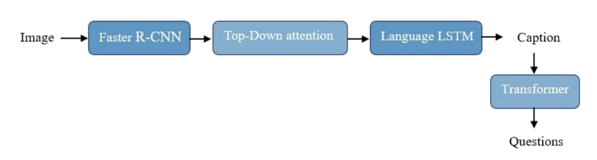
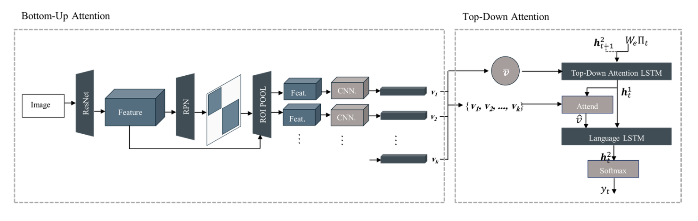
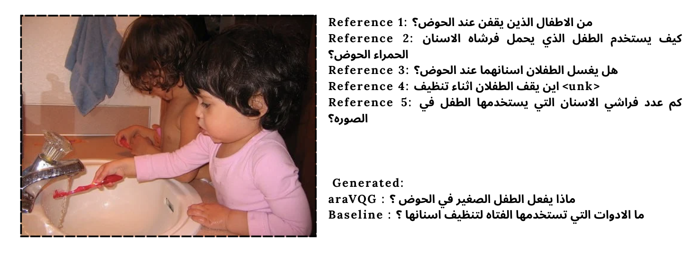

# Arabic Visual Question Generation (VQG)
## Generating Context-Aware Questions from Images Using Deep Learning

### Abstract
This project introduces a deep learning framework for Arabic Visual Question Generation (VQG). The system employs a Bottom-Up and Top-Down Attention mechanism to generate linguistically accurate and contextually relevant Arabic questions from images. By integrating Faster R-CNN for visual feature extraction and an LSTM-based architecture for language modeling, the project addresses the gap in Arabic vision-language research.

The implementation is built upon and adapted from the work of [Pooja Hira](https://github.com/poojahira/image-captioning-bottom-up-top-down), with modifications to the environment, language processing pipeline, and the core task to support Arabic VQG.

### Baseline Model

To evaluate the effectiveness of the proposed architecture, a baseline model was implemented for comparison. The baseline follows a two-stage pipeline:
1. **Arabic Image Captioning:** Generating a descriptive caption from the input image.
2. **Text-to-Question Transformation:** Converting the generated caption into a question using a rule-based or language model approach.

Unlike our proposed context-aware model, the baseline relies on the intermediate caption, which may lead to information loss regarding specific visual details.

### Proposed Approach

The core of our system is based on the **Bottom-Up and Top-Down Attention** architecture. This specific architecture was utilized for both the Image Captioning baseline and our final Visual Question Generation (VQG) model, ensuring a consistent and powerful visual-linguistic feature extraction process.

The model uses a **Faster R-CNN** to identify image regions (Bottom-Up) and a **dual-layer LSTM** to selectively attend to those regions (Top-Down) during text generation.

This architecture is adapted from the original work by Peter Anderson et al., which serves as the primary reference for our implementation:

> Anderson, P., He, X., Buehler, C., Teney, D., Johnson, M., Gould, S., & Zhang, L. (2018). **Bottom-Up and Top-Down Attention for Image Captioning and Visual Question Answering.** In *Proceedings of the IEEE Conference on Computer Vision and Pattern Recognition (CVPR)*.

### Key Contributions

The primary contributions of this research involve the adaptation of visual-linguistic models for the Arabic language, specifically:

## Key Contributions

1. **Large-Scale Arabic Translation:** Translated approximately 93,000 MS-COCO image captions into Arabic.
2. **Arabic VQG Dataset:** Engineered a comprehensive dataset by transforming Arabic captions into context-aware visual questions.
3. **Model Adaptation & Optimization:** Adapted the Bottom-Up and Top-Down Attention framework for Arabic linguistics and updated the environment to **Python 3.12.6** for modern compatibility.
 

## Team Members

